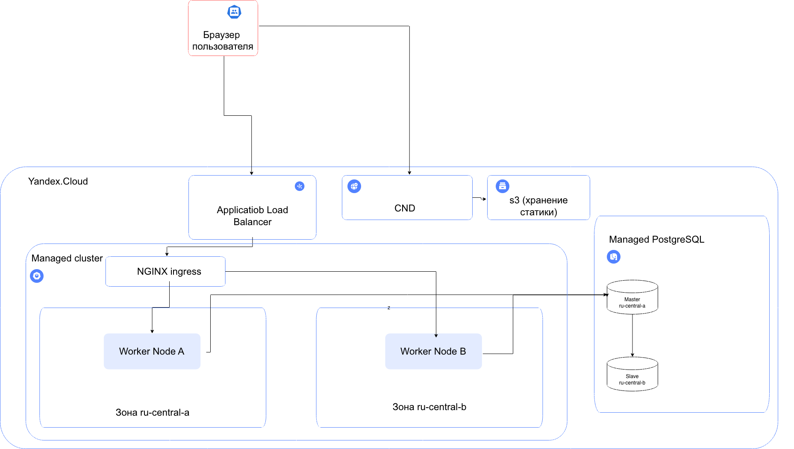
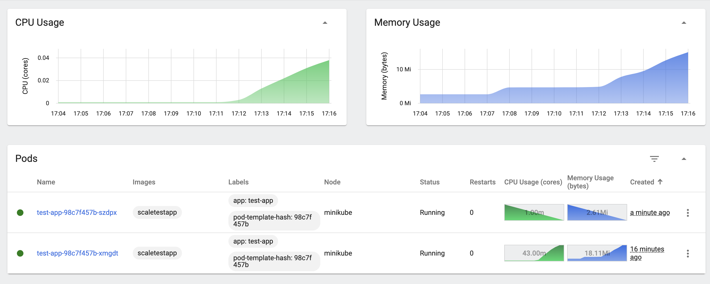
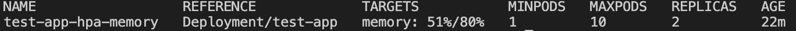
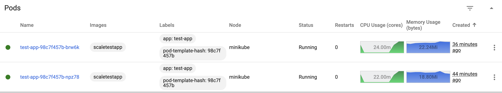
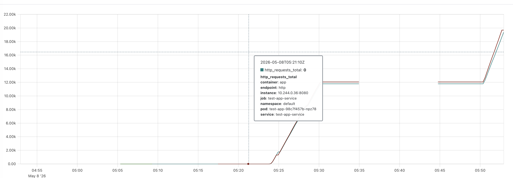
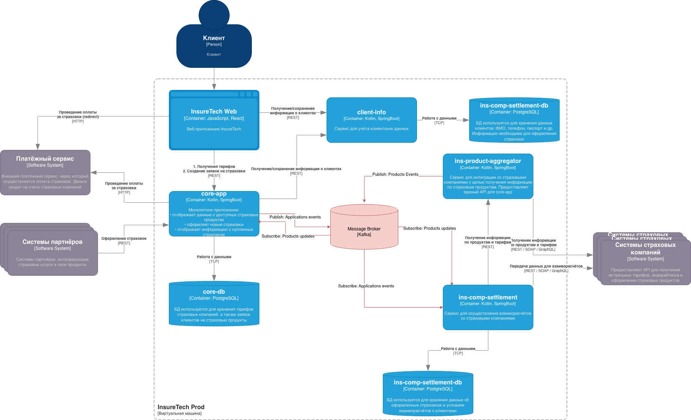
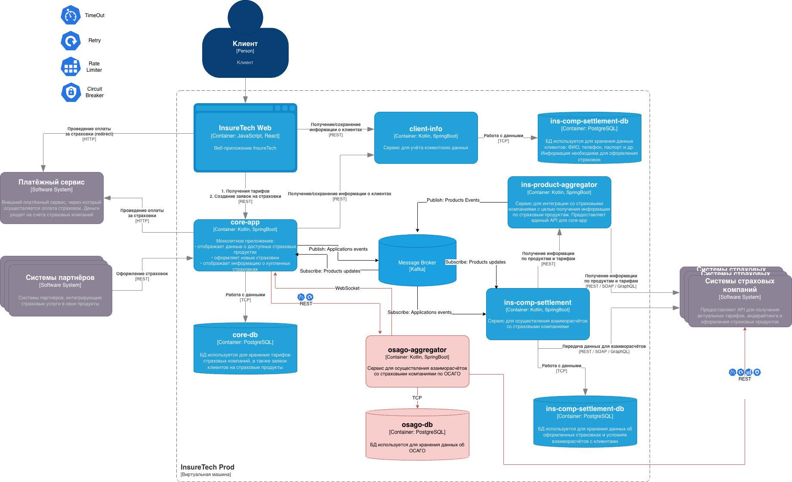

# Задание 1

- Используем регион Yandex Cloud с двумя зонами доступности.
- Каждый сервис разворачивается минимум в двух репликах, распределённых по зонам.
- Статика отдаётся через CDN (например, Yandex Cloud CDN).
- Для динамических запросов — геобалансировка на уровне DNS или HTTP-балансировщика (Application Load Balancer Yandex Cloud), который умеет направлять трафик в ближайший бэкенд.

[схема в drawio](./task-1/start_scheme-1.drawio)




# Задание 2

## Часть 1
Собираем образ `scaletestapp` из репозитория `https://github.com/Yandex-Practicum/scaletestapp`

Устанавливаем locust

```bash
minikube start --memory=4096 --cpus=2

minikube image load scaletestapp

minikube addons enable metrics-server

kubectl apply -f deployment.yaml
kubectl apply -f service.yaml
kubectl apply -f hpa-memory.yaml

kubectl apply -f servicemonitor.yaml

minikube service test-app-service --url

locust -f locustfile.py --host http://[service_url]:[service_port]

```

Получили увеличение подов



## Часть 2

```bash
helm repo add prometheus-community https://prometheus-community.github.io/helm-charts

helm install monitoring prometheus-community/kube-prometheus-stack \
  --namespace monitoring --create-namespace

helm install prometheus-adapter prometheus-community/prometheus-adapter \
--set prometheus.url=http://prometheus-server.smonitoring.svc.cluster.local \
--namespace monitoring

kubectl apply -f hpa-rps.yaml

kubectl get --raw "/apis/custom.metrics.k8s.io/v1beta1/namespaces/default/pods/*/http_requests_per_second" | jq .
```

Получили увеличение подов




# Задание 3
### 1. Анализ проблем и рисков

**Проблемы:**
1.  **Синхронная зависимость:** Сервисы `core-app` и `ins-comp-settlement` напрямую зависят от времени ответа `ins-product-aggregator`, который, в свою очередь, опрашивает 5 (скоро 10) внешних страховых компаний. Это создает "узкое горлышко" и долгие ответы.
2.  **Отсутствие изоляции:** Партнер, превышающий лимиты, блокирует работу всей системы, так как ресурсы Kubernetes-пода распределяются равномерно.
3.  **Поллинг данных:** Использование периодического опроса (раз в 15 минут или раз в сутки) приводит к задержкам в актуальности данных и лишней нагрузке на сеть.

**Риски при росте нагрузки:**
*   Полная недоступность сервиса (Downtime) во время рекламной кампании из-за исчерпания ресурсов CPU/Memory подами `core-app`.
*   Потеря данных о заявках, если `ins-comp-settlement` не успеет опросить `core-app` в момент сбоя.

### 2. Предлагаемое решение

1.  **Внедрение Message Broker (Kafka):**
    *   Внедряем брокер сообщений для асинхронного обмена данными.
2.  **Event-Streaming для продуктов:**
    *   `ins-product-aggregator` асинхронно собирает данные от страховых компаний и публикует событие `ProductUpdated` в Kafka.
    *   `core-app` и `ins-comp-settlement` подписываются на топик и обновляют свои локальные кэши. Это убирает синхронные вызовы к агрегатору.
3.  **Event-Streaming для заявок:**
    *   `core-app` публикует событие `ApplicationCreated` при оформлении страховки.
    *   `ins-comp-settlement` подписывается на это событие, получая данные в реальном времени без опроса.
4.  **Transactional Outbox:**
    *   Используем паттерн Transactional Outbox в `core-app` (и `ins-product-aggregator`), чтобы гарантировать, что событие в Kafka будет отправлено только при успешном сохранении данных в БД.

### Основные изменения на схеме:
1.  Добавлен компонент **Message Broker (Kafka)**.
2.  **ins-product-aggregator** больше не вызывается синхронно. Он отправляет данные в Kafka.
3.  **core-app** и **ins-comp-settlement** получают данные о продуктах из Kafka (обновляя локальную реплику).
4.  **ins-comp-settlement** получает данные о заявках из Kafka (события от core-app), отпадая необходимость в REST-запросе к core-app раз в сутки.


[diagram_containers.drawio](./task-3/diagram_containers.drawio)





# Задание 4

## Решения по архитектуре ОСАГО:

### 1. **osago-aggregator**:
- **Нужна своя БД** (osago-db) для хранения:
  - Заявок, отправленных в страховые компании
  - Результатов опросов
  - Статусов заявок
  - Корреляции внутренней заявки с заявками в разных СК

### 2. **API osago-aggregator для core-app**:
- REST API для создания заявки
- REST API для получения статуса
- WebSocket/SSE для push-уведомлений

### 3. **Интеграция core-app ↔ osago-aggregator**:
- Синхронный REST для создания заявки
- Асинхронный WebSocket для получения результатов

### 4. **API для веб-приложения**:
- REST для создания заявки
- **Server-Sent Events (SSE)** для получения предложений в реальном времени

### 5. **Паттерны отказоустойчивости**:
- **Timeout**: 60 секунд при вызове страховых компаний
- **Retry**: при временных ошибках опроса СК
- **Circuit Breaker**: защита от недоступных СК
- **Rate Limiting**: 
  - Для веб-приложения (2500 пользователей)
  - Для вызовов к СК (ограничения API)

## Детали применения паттернов:

### **Web → CoreApp**:
- **Rate Limiting**: защита от 2500 одновременных пользователей
- **Timeout**: ограничение времени запроса
- **SSE**: для push-уведомлений о предложениях ОСАГО

### **CoreApp → osago-aggregator**:
- **Timeout**: ограничение времени ответа
- **Retry**: повтор при временных ошибках
- WebSocket для асинхронных уведомлений

### **osago-aggregator → Страховые компании**:
- **Timeout (60 сек)**: максимальное время ожидания
- **Retry**: повторный опрос при ошибках
- **Circuit Breaker**: отключение недоступных СК
- **Rate Limiting**: соблюдение лимитов API СК


[diagram_containers.drawio](./task-4/diagram_containers.drawio)



